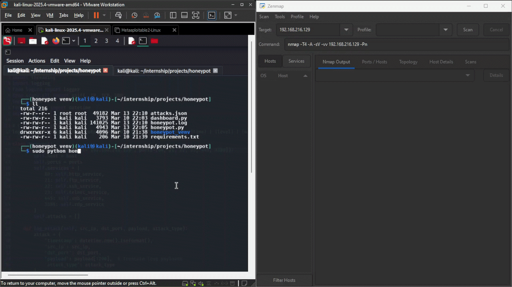

# Python-based-honeypot
A honeypot to attract and detect malicious traffic, providing insights into attack methodologies.

# The Run Program with🛡️Detect Scanning
<div align="center">
  
  <p align="center">
    <b>Figure 1:</b> Honeypot Demo
  </p>
</div>


# Installation & Usage
## Clone the repository
```
git clone https://github.com/Cyb3Raiz000/Python-based-honeypot.git
```

## Got to Project Directory
```
cd Python-based-honeypot
```

## Create Virtual Environment For the project
```
python -m venv honeypot_venv
```

## Activate Virtual Environment
```
source honeypot_venv/bin/activate
```

## Now Install All the required python libraries
```
 pip install -r requirements.txt
```

# Configure IP-Address
Must Replace the IP-Address to your Machine IP from the python file.

## Than you can run the program
```
sudo python honeypot.py
```

# Watch Full Video Capture
[](https://drive.google.com/file/d/1eJQJlbiLPuRxACpmij70c7IF61I33G77/view?usp=sharing)

## 📖 Overview
Custom Python automated program to Detect attack methodologies...
